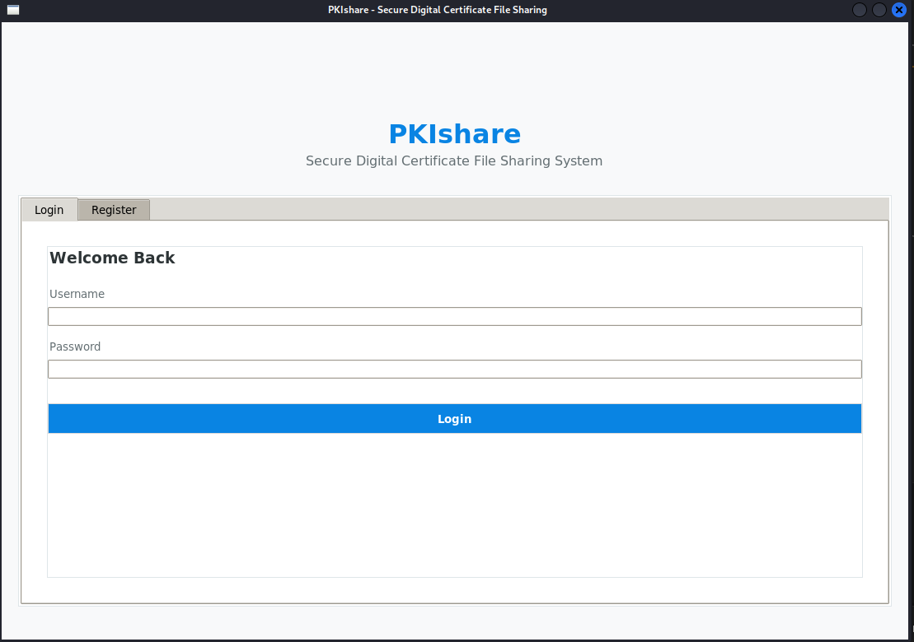

# PKIshare
A secure file sharing application built with Public Key Infrastructure (PKI) principles



## Quick Start

```bash
# Clone and install
cd PKIshare
pip install -r requirements.txt

# Run
python main.py
```

Or with Docker:
```bash
docker build -t pki-share .
docker run -it --rm --net=host -e DISPLAY=$DISPLAY -v /tmp/.X11-unix:/tmp/.X11-unix pki-share
```

## Features

| Category | Description |
|----------|-------------|
| **User Management** | Secure registration, login, account deletion, auto-generated certificates |
| **File Sharing** | Encrypted sharing with specific recipients, access revocation/granting, digital signatures |
| **Personal Repository** | Password-protected encrypted storage for personal files |
| **GUI** | Modern Tkinter interface with file preview, user list, certificate viewer |

## Security

- **Hybrid Encryption**: Fernet (AES-128) for files + RSA-2048 for key exchange
- **Key Derivation**: SHA-256 with per-user salt
- **Digital Signatures**: SHA-256 with RSA for integrity verification
- **Access Control**: Per-file ACLs with owner-based permissions

## Project Structure

```
PKIshare/
├── main.py           # Entry point
├── requirements.txt  # Dependencies
├── core/
│   ├── secure_share.py   # PKIshareCore class
│   ├── database.py       # SQLite layer
│   ├── models.py         # Data models
│   └── utils.py          # Crypto utilities
├── gui/
│   └── app.py            # Tkinter GUI
└── data/             # App data (auto-created)
```

## Dependencies

- Python 3.10+
- cryptography>=41.0.0
- Pillow>=10.0.0
- Tkinter, SQLite3 (built-in)

## Usage Guide

1. **Register** - Create account with unique username/password
2. **Login** - Authenticate with credentials
3. **Share File** - Select file and recipients → encrypted & signed
4. **My Files** - View, preview, download, or manage access
5. **Shared Repository** - Personal encrypted vault (set share password first)

## API Reference

```python
# User Management
core.create_user_account(username, password) -> bool
core.authenticate_user(username, password) -> bool
core.delete_account(password) -> bool

# File Sharing
core.distribute_file(filepath, recipients, password) -> bool
core.retrieve_file(file_id, save_path, password) -> bool
core.remove_file_access(file_id, username) -> bool
core.grant_file_access(file_id, username, password) -> bool

# Repository
core.store_in_share(filepath, password) -> bool
core.list_share_contents() -> List[Dict]
core.extract_from_share(share_id, save_path, password) -> bool
```

## Database Schema

- **users**: accounts, password hashes, encrypted private keys
- **certificates**: X.509-style user certificates
- **encrypted_files**: shared file metadata & signatures
- **file_keys**: RSA-encrypted symmetric keys per user
- **shared_files**: personal repository files
- **revoked_certs**: certificate revocation list

## Contributing

1. Fork the repository
2. Create feature branch (`git checkout -b feature/amazing-feature`)
3. Commit changes and push
4. Open a Pull Request

## License

MIT License - see [LICENSE](LICENSE) file.

## Security Warning

Educational project. For production: use bcrypt/Argon2, proper CA, rate limiting, audit logging, 2FA.

---

**Author**: RK-tamang | **GitHub**: [@RK-tamang](https://github.com/RK-tamang)
